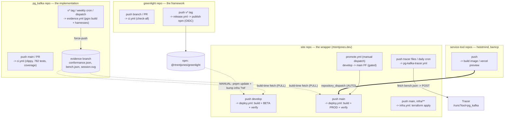
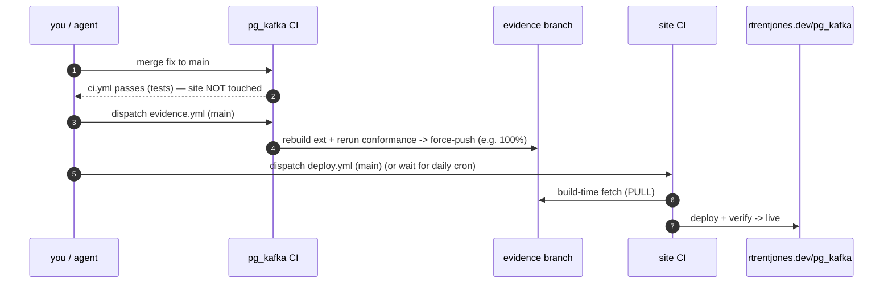

# CI throughline — what a push in each repo does

**Headline: every repo's CI is self-contained. Pushes never auto-cascade across repos.**
Propagation between them is *deliberate* — a manual dep bump, a build-time pull, or one explicit
dispatch. There is exactly one true cross-repo push automation, and it is **not** pg_kafka's.

Two planes:
- **Control plane (Greenlight)** — runs the *site's* lifecycle (`deploy → verify → promote`) and the
  real service tools. pg_kafka's *page* rides the site's loop.
- **Data plane (evidence)** — pg_kafka's *content* (the conformance grid, benchmark, recording) is
  generated by pg_kafka's own CI and published to its `evidence` branch; the site reads it at build
  time. Greenlight is not in this plane.

> Why pg_kafka is different: it's an *implementation*, not a service, so its "live" surface is
> continuously-verified **evidence**, not a running URL. See [the project write-up](https://rtrentjones.dev/pg_kafka).

## The map



**Legend:** solid `-->` = a trigger fires within a repo · double `==>` = the one *automatic* cross-repo
push (the service-tool dispatch bridge) · dashed `-.->` = a *deliberate* hop (a manual bump, or the
site **pulling** the evidence at build time).

## Per-repo cheat sheet

| Repo | Push / event | Workflow | Effect |
| --- | --- | --- | --- |
| **greenlight** | branch / PR | `ci.yml` | `check-all` (build · lint · test · boundaries) — validate only |
| **greenlight** | `v*` tag | `release.yml` | publish `@rtrentjones/greenlight` to npm (OIDC); the tag is what `infra ?ref=` pins |
| **pg_kafka** | `main` / PR | `ci.yml` | clippy · 782 tests · coverage — **does not touch evidence or the site** |
| **pg_kafka** | `v*` tag · weekly cron · dispatch | `evidence.yml` | build the extension, run conformance + benchmark + recording, **force-push the `evidence` branch** |
| **site** | push `develop` | `deploy.yml` | build (fetches evidence) + deploy **BETA** + verify |
| **site** | push `main` | `deploy.yml` | build + deploy **PROD** + verify |
| **site** | push `main`, `infra/**` | `infra.yml` | `terraform apply` (HCP) |
| **site** | push tracer files / daily cron | `pg-kafka-tracer.yml` | fetch pg_kafka `bench.json` → POST to Tracer |
| **site** | manual dispatch | `promote.yml` | gated `develop` → `main` fast-forward |
| **heistmind / bamcp** | push | (their CI) | build image / Vercel preview → `repository_dispatch` into the site |

## The three seams (how a change crosses repos)

1. **npm dep** (greenlight → site): *manual*. `pnpm update @rtrentjones/greenlight` + bump `infra ?ref`,
   then push the site. `greenlight doctor` enforces the version ↔ `?ref` lockstep.
2. **evidence branch** (pg_kafka → site): *pull, not push*. The site fetches the artifacts at build
   time; they only refresh when the **site** rebuilds (a site push, or the daily `deploy.yml` cron).
3. **dispatch bridge** (service tools → site): *automatic* `repository_dispatch` — the lone cross-repo
   push trigger. pg_kafka deliberately does **not** use this.

## Worked example — a pg_kafka fix reaching the live grid



## The one gotcha to internalize

**Merging to pg_kafka `main` does not change the site.** `ci.yml` runs (tests), but the matrix is
produced by `evidence.yml`, which fires only on a **tag**, the **weekly cron**, or a **manual
dispatch** — and even then it lands on the `evidence` branch, which the site only reads on its **next
build**. So "ship a pg_kafka fix to the live grid" is always **three deliberate steps**:

```
merge pg_kafka -> dispatch evidence.yml -> rebuild the site
```

That decoupling is the throughline.
